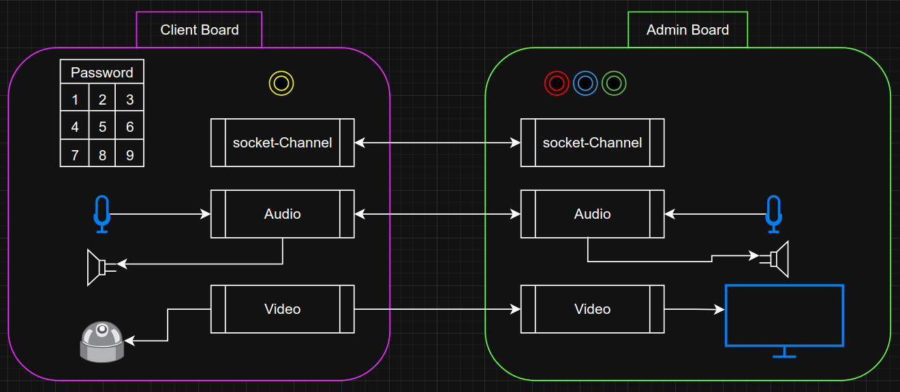

# Intercoom

## Overview
This project designs a system in which the user can communicate by video &amp; audio with the person within the house.
This system includes 2 main components:
1. External Device (Server): can be Raspberry PI/Arduino with camera, 
   microphone, 
   bell-button, speaker.
2. Internal Device (Client): this used as the server, which essentially some 
   device 
- can be also Raspberry PI.
   it includes display-monitor, buttons grid (answer/open connection, decline), speaker.

## Diagrams

### Hardware Diagram

### Class Diagram
